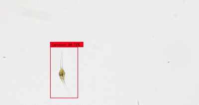

# Microorganism Image Classifier
A collection of datasets and neural networks for microorganism image classification.

## Contributers:
Sari Sabban - Tarik Alafif - Abdullah Alotebi - Sally Warring - Zainab Alsaeedi - Stefan Geisen - Wenjia Wu





## Description:
This is a collection of datasets and neural networks to detect or classify microorganisms from microscope images. Provided here are all the necessary scripts, datasets, and weights. So far this project either detects or classifies the following organisms:

<p align="center">Protists - 17 genuses:</p>

<sub>*Colsterium - Cylindrocystis - Lepocinclis - Micrasterias - Paramecium - Peridinium - Pinnularia - Pleurotaenium - Pyrocystis - Volvox - Ceratium - Coleps - Collodictyon - Didinium - Dinobryon - Frontonia - Phacus*</sub>

<p align="center">Amoebas:</p>

<sub>*Just detection of generic cells and differentiates between the active and inactive stages of their life cycle.*</sub>

<p align="center">Nematodes:</p>

<sub>*Either classifies nematodes according to trophic level (CNN), or detects generic nematodes (Object Detection), or detects nematodes pixel wise (Semantic Segmentation) for biomass estimation*</sub>

## Available datasets and trained weight files
All datasets used are available here for download, along with their neural network weights for detection/classification.

|Dataset Name                                                                                                                    |Network            |Weights                                                                                                                                                                     |Labels                                                                      |Accuracy or mAP or Dice|
|--------------------------------------------------------------------------------------------------------------------------------|-------------------|----------------------------------------------------------------------------------------------------------------------------------------------------------------------------|----------------------------------------------------------------------------|-----------------------|
|[Amoeba Active/Inactive Dataset](https://www.dropbox.com/s/vf2ftfige4vu0ie/Amoeba.tar.bz2?dl=0)                                 |YOLOv3             |[Weights](https://www.dropbox.com/s/x044cdo7kznoeuf/Amoeba.h5?dl=0)                                                                                                         |[Labels](https://www.dropbox.com/s/wxvy9lhlv2w99l8/Amoeba_labels.pkl?dl=0)  |0.6473                 |
|[Cell Detection Dataset](https://www.dropbox.com/s/2woe91t03rw9kbm/Cells.tar.bz2?dl=0)                                          |YOLOv3             |[Weights](https://www.dropbox.com/s/yukp34x3gaubd4u/Cells.h5?dl=0)                                                                                                          |[Labels](https://www.dropbox.com/s/dkz3ws6g5b23ceo/Cell_labels.pkl?dl=0)    |0.9549                 |
|[Nematode Trophic Classification by Head Dataset](https://www.dropbox.com/s/xyuegz9o1qrtki6/Nematodes_Trophic_Head.tar.bz2?dl=0)|VGG16              |[Weights](https://www.dropbox.com/s/8l5fg3y73oyflae/Nematode_Head.h5?dl=0)                                                                                                  | -----                                                                      |1.0000                 |
|[Nematode Trophic Classification by Body Dataset](https://www.dropbox.com/s/86vh1snh5dg83j7/Nematodes_Trophic_Body.tar.bz2?dl=0)|VGG16              |[Weights](https://www.dropbox.com/s/5h4r9mdwkcsj8gk/Nematode_Body.h5?dl=0)                                                                                                  | -----                                                                      |0.9861                 |
|[Nematode Object and Semantic Detection Dataset](https://www.dropbox.com/s/n3q9sgf0img93uw/Nematodes.tar.bz2?dl=0)              |YOLOv3 <br /> UNet |[Object Weights](https://www.dropbox.com/s/pnw7im1qmgfunqd/Nematode_Object.h5?dl=0) <br /> [Semantic Weights](https://www.dropbox.com/s/67h87ck8wtt0g8f/unet_binary.h5?dl=0)|[Labels](https://www.dropbox.com/s/cyc3sjcqt3arxpt/Nematode_labels.pkl?dl=0)|0.7365 <br /> 0.9997 <sub>(Images must be 1440x1056)|
|[Protist Object and Semantic Detection Dataset](https://www.dropbox.com/s/g1uc99clsl1dnyv/Protists.tar.bz2?dl=0)                |YOLOv3 <br /> FCN-8|[Object Weights](https://www.dropbox.com/s/uo396owrvnfa1gq/Protists_Object.h5?dl=0) <br /> [Semantic Weights](https://www.dropbox.com/s/phxqdjg0vvrighe/fcn_8_multi.h5?dl=0)|[Labels](https://www.dropbox.com/s/pdhfwtcadf9vbyf/Protist_labels.pkl?dl=0) |0.9625 <br /> 0.9839 <sub>(Images must be 960x704 - model failed)</sub>|

## How to use:
This is a [Video]() on how to use this whole setup.

### Update your system and install libraries.
This setup works on GNU/Linux Ubuntu 18.04+ using Python 3.6+. To use this script you will need to first update your system and install the dependencies, within a virtual environment, using the following commands:

`sudo apt update`

`sudo apt full-upgrade`

`sudo apt install python3-pip`

`python3 -m venv env`

`source env/bin/activate`

`pip3 install numpy pandas keras tensorflow seaborn matplotlib imgaug scipy pillow sklearn scikit-image imutils h5py opencv-contrib-python pydensecrf tqdm`

`deactivate`

### Setting up a dataset
If you want to develop your own dataset and train it follow these steps, otherwise skip to the **Detection** section. For help use this command:

`python SinfNet.py --help` or `python SinfNet.py -h`

**Contributing to the dataset**
If you would like to add images to our dataset (any type of microscopic organism) make sure that each species has 50-100 annotated images (both object and semantic) where each image is sharp and taken from a bright-field light microscope at 400x magnification and the size of the image is width = 2584 px and hight = 1936 px. Please contact me so we can work together.

#### For whole image classification
1. Start by collecting enough images of the organism, more than 100 images is preferable.

2. If you would like to augment the images use the following command:

`python SinfNet.py --augment_cnn IMAGE_INPUT IMAGE_OUTPUT NUMBER` example `python SinfNet.py -ac dataset/Images dataset/Augmented 10`

Where IMAGE_INPUT is the directory that contains the original images, IMAGE_OUTPUT is the directory to output the augmented images, and NUMBER is the number of augments to each image.

3. Generate three directories: Train, Valid, and Tests. Then shuffle your dataset and randomly split each class into a *Training* (60% of images), *Testing* (20% of images), and *Validation* (20% of images) sets using the following command:

`shuf -n NUMBER -e ./dataset/Train/CLASS | xargs -i mv {} ./dataset/Valid/CLASS`
`shuf -n NUMBER -e ./dataset/Train/CLASS | xargs -i mv {} ./dataset/Tests/CLASS`

Where NUMBER is the number of images that will be moved (calculated as 60% or 20% of the total images in the dataset), and CLASS is the specific class (label) for the images. This is to ensure that the sets are randomly split before training the neural network.

#### For object detection
1. Collect images containing your objects. Even though the network can process different image formats, it is best to stick with the .jpg image format. If you can generate a total-slide scan (a single image of an entire slide) you can segment this large image into smaller images to build your dataset, use the following command to segment:

`python SinfNet.py --segment FILENAME WIDTH HIGHT` example `python SinfNet.py -S Diatoms.jpg 2584 1936`

2. Open the web-based GUI annotation tool using the following command:

`python SinfNet.py --via` example `python SinfNet.py -v`

You must have FireFox for this to work. Add the labels under Attributes > Attribute name found in the bottom left, then start annotating each image.

3. Once finished, download and save your annotations as a .csv file from Annotations > Export Annotations (as csv) found in the top left.

4. Do not delete the .csv file, rather save it in case you want to rename/fix/change any of the labels.

5. Convert the .csv file to .xml files using the following command:

`python SinfNet.py --translate_bbox IMAGE_DIRECTORY ANNOTATION_INPUT ANNOTATION_OUTPUT INPUT_FORMAT OUTPUT_FORMAT` example `python SinfNet.py -tb ./dataset/Images ./dataset/Annotations ./dataset/Translations csv xml`

Where IMAGE_DIRECTORY is the directory where the images are located, ANNOTATION_INPUT is the the directory or file (.csv) where the annotations are located, ANNOTATION_OUTPUT is the the directory where the translated annotation will be outputted, INPUT_FORMAT is the format of the input annotations, OUTPUT_FORMAT is the format of the output annotations. Identify only the sigle file for the .csv, while .json .txt .xml files must identify the directory the multiple files reside in.

6. If you would like to augment the images that have object detection annotations (bounding boxes) use the following command:

`python SinfNet.py --augment_bbox IMAGE_INPUT IMAGE_OUTPUT ANNOTATION_INPUT ANNOTATION_OUTPUT INPUT_FORMAT OUTPUT_FORMAT NUMBER` example `python SinfNet.py -ab ./dataset/Images ./dataset/Augmented_Images ./dataset/Augments.csv ./dataset/Augmented_Annotations csv xml 10`

Where IMAGE_INPUT is the directory where the images are located, IMAGE_OUTPUT is the directory where the augmented images will be outputted, ANNOTATION_INPUT is the directory or file where the annotations are located, ANNOTATION_OUTPUT is the directory where the augmented annotations will be outputted, INPUT_FORMAT is the format of the input annotations, OUTPUT_FORMAT is the format of the output annotations, and NUMBER is the number of augments per image. Identify only a sigle file for the .csv, while .json .txt .xml files must identify the directory the multiple files reside in.

7. To check that the bounding box augmentations was performed correctly (the augmented boxes are ontop on the object in the augmented images) use the following command:

`python SinfNet.py --check_box IMAGE_INPUT ANNOTATION_INPUT` exmaple `python SinfNet.py -Cb ./dataset/Augmented_Images ./dataset/Augmented_Annotations`

Where IMAGE_INPUT is the directory where the images are located and ANNOTATION_INPUT is the directory where the annotations are located.

#### For semantic segmentation

1. The UNet neural network in this project only takes images with dimentions that are multiples of 32, therefore it is possible to crop the images to satisfy this restriction using the following command:

`python SinfNet.py --crop FILENAME` example `python SinfNet.py -C ./dataset/Images/1.jpg`

This command works on single images, if you have multiple images you will have to construct a loop to go through all of them. **Advice:** place the image name between `''` for example `python SinfNet.py -C './dataset/Images/1.jpg'` since this will allow the command to work even if the image's filename has spaces in it.

2. Follow the same steps as object detection except use polygons instead of squares to annotate the organisms.

3. Convert the .csv file to .json files using the following command:

`python SinfNet.py --translate_poly IMAGE_DIRECTORY ANNOTATION_INPUT ANNOTATION_OUTPUT INPUT_FORMAT OUTPUT_FORMAT` example `python SinfNet.py -tp ./dataset/Images ./dataset/Annotations.csv ./dataset/Translations csv json`

Where IMAGE_DIRECTORY is the directory where the images are located, ANNOTATION_INPUT is the directory where the annotations are located, ANNOTATION_OUTPUT is the directory where the translated annotations will be outputted, INPUT_FORMAT is the format of the input annotations, OUTPUT_FORMAT is the format of the output annotations.

4. If you would like to augment the images that have semantic detection annotations (bounding polygons) use the following command:

`python SinfNet.py ---augment_poly IMAGE_DIRECTORY ANNOTATION_INPUT TRANSLATED_ANNOTATION_OUTPUT INPUT_FORMAT OUTPUT_FORMAT IMAGE_OUTPUT ANNOTATION_OUTPUT NUMBER` example `python SinfNet.py -ap ./dataset/Images ./dataset/Annotations.csv ./dataset/Translated_Annotations csv json ./dataset/Augmented_Images ./dataset/Augmented_Annotations 10`

Where IMAGE_DIRECTORY is the directory where the images are located, ANNOTATION_INPUT is the directory where the annotations are located, TRANSLATED_ANNOTATION_OUTPUT is the directory where the translated annotations will be outputted, INPUT_FORMAT is the format of the input annotations, OUTPUT_FORMAT is the format of the output annotations, IMAGE_OUTPUT is the directory where the augmented images will be outputted, ANNOTATION_OUTPUT is the directory where the augmented annotations will be outputted, and NUMBER is the number of augments per image. Identify only a sigle file for the .csv, while .json .txt .xml files must identify the directory the multiple files reside in.

5. To check that the bounding polygon augmentations was performed correctly (the augmented polygons are ontop on the object in the augmented images) use the following command:

`python SinfNet.py --check_poly IMAGE_INPUT ANNOTATION_INPUT` example `python SinfNet.py -Cp ./dataset/Augmented_Images ./dataset/Augmented_Annotations`

Where IMAGE_INPUT is the directory where the images are located and ANNOTATION_INPUT is the directory where the annotations are located.

### Training the neural network
#### For classification
1. You can train the images on a CNN using the following command:

`python SinfNet.py --cnn_train NETWORK TRAIN VALID TESTS` example `python SinfNet.py -ct CNN ./dataset/Train ./dataset/Valid ./dataset/Tests`

Where NETWORK is the name of the convolutional neural network that you want to use. Choose one of the following [VGG16, VGG19, ResNet50, DenseNet201], TRAIN is the directory that contains the training set, VALID is the directory that contains the validation set, and TESTS is the directory that contains the test sets.

2. Training, loss, and confusion matrix figures will be generated after the training is done. An evaluation on the test set will be performed and the result printed on the terminal.

#### For object detection
1. Use the following command to train the network on your dataset:

`python SinfNet.py --object_train WEIGHTS TRAIN ANNOTATION LABEL1 LABEL2 ...` example `python SinfNet.py -ot Amoeba ./dataset/Images ./dataset/Annotations Active Inactive`

The WEIGHTS is the name of the output weight.h5 file, TRAIN is the directory of the images to train on, ANNOTATION is the directory containing the annotations of these images, and the LABELS is a list of all the labels in the dataset (just the labels written with space between them). The network is resource heavy and requires a multiple GPUs and more than 32GB of RAM to run (depending on dataset size). Therefore some cloud GPU services may not work and a larger system is required.

2. A logs directory will be generated containing the training logs. View the data using the following command if you have tensorboard installed:

`tensorboard --logdir=./logs`

3. The .h5 file is the weights file, it is the result of the training and will be used for image detection, save this file.

4. If the training is interrupted, you can use the .h5 file to continue where you left off using the exact same training command in step 1, just make sure the .h5 weights file is included in the same directory as the SingNet.py script.

#### For semantic segmentation
1. Follow the same steps as object detection, use the following command to train:

`python SinfNet.py --semantic_train NETWORK MODE TRAIN ANNOTATION LABEL1 LABEL2 ...` example `python SinfNet.py -st unet multi ./dataset/Images ./dataset/Annotations Active Inactive`

Where MODE can be either binary (for single or multiple classes being coloured white with a black background) or multi (for single or multiple classes being coloured differently on a black background), the NETWORK can be wither unet or fcn_8, TRAIN is the directory of the images to train on, ANNOTATION is the directory containing the annotations of these images, and the LABELS is a list of all the labels in the dataset (just the labels written with space between them). As with object detection, including pre-trained weights is possible:

2. The .h5 file is the weights file, it is the result of the training and will be used for image detection, save this file.

3. If the training is interrupted, you can use the .h5 file to continue where you left off using the exact same training command in step 1, just make sure the .h5 weights file is included in the same directory as the SingNet.py script.

### Detection
#### For classification
1. Download the relevant weights file (links available in table above) or generate the file from the steps above (Setting up a dataset and Training the neural network).

2. To run a classification use the following command:

`python SinfNet.py --cnn_predict NETWORK WEIGHTS FILENAME` example `python SinfNet.py -cp ResNet50 Nematodes.h5 image.jpg`

Where the NETWORK is the name of the network that was used to generate the WEIGHTS.h5 file (using different a network than the weights file does not work), WEIGHTS is the name of the .h5 weights file, and FILENAME is the name of the image file.

#### For object detection
1. Download the relevant weights and labels files (links available in table above) or generate the file from the steps above (Setting up a dataset and Training the neural network).

2. Detect objects in your image, video, or webcam using the following command:

`python SinfNet.py --object_predict WEIGHTS LABELS FILENAME` example `python SinfNet.py -op Amoeba.h5 labels.pkl image.jpg`

Where WEIGHTS is the weights.h5 file, LABELS is the labels.pkl file, and FILENAME can be either a .jpg image, .mp4 video, or a webcam input.

#### For semantic segmentation
1. Download the relevant weights and labels files (links available in table above) or generate the file from the steps above (Setting up a dataset and Training the neural network).

2. Detect objects in your image using the following command:

`python SinfNet.py --semantic_predict NETWORK MODE LABELS FILENAME` example `python SinfNet.py -sp unet binary labels.pkl image.jpg`

Where NETWORK can be wither unet or fcn_8, MODE either binary or multi, and FILENAME is the name of the image file.

## Nematode Biomass Approximation:
`python SinfNet.py --biomass NETWORK MODE LABELS FILENAME RESOLUTION DEPTH` or `python SinfNet.py -B unet binary Nematode_labels.pkl nematode.jpg 0.58 100`

Where NETWORK (unet, fcn_8), MODE (binary, multi), LABELS .pkl filename (labels.pkl), FILENAME .jpg image, RESOLUTION is the size of 1 pixel in micrometers, and DEPTH is the depth of the slide micrometers (100 is standard for slides and haemocytometers). The calculation for this function is taken from [this paper](https://doi.org/10.1016/j.soilbio.2019.03.021). Finding the resolution depends on your light microscope's setup.

## Table of commands:
|Command                                                                                                                                             |Description|
|----------------------------------------------------------------------------------------------------------------------------------------------------|-----------|
|python SinfNet.py -ac IMAGE_INPUT IMAGE_OUTPUT NUMBER                                                                                               |Augment whole images of a CNN, where IMAGE_INPUT is the directory of images, IMAGE_OUTPUT is the directory to output the augmented images, and NUMBER is the number of augments to each image|
|python SinfNet.py -ab IMAGE_INPUT IMAGE_OUTPUT ANNOTATION_INPUT ANNOTATION_OUTPUT INPUT_FORMAT OUTPUT_FORMAT NUMBER                                 |Augment images with bounding boxes, where IMAGE_INPUT is the directory of images, IMAGE_OUTPUT is the directory to output the augmented images, ANNOTATION_INPUT is the input file or directory of the annotations, ANNOTATION_OUTPUT is the output file or directory of the annotations, and NUMBER is the number of augments to each image, INPUT_FORMAT is the input format, OUTPUT_FORMAT is the output format|
|python SinfNet.py -ap IMAGE_DIRECTORY ANNOTATION_INPUT TRANSLATED_ANNOTATION_OUTPUT INPUT_FORMAT OUTPUT_FORMAT IMAGE_OUTPUT ANNOTATION_OUTPUT NUMBER|Augment images with bounding polygons, where IMAGE_DIRECTORY is the directory of images to be augmented, ANNOTATION_INPUT is the directory of .csv file of annotations, TRANSLATED_ANNOTATION_OUTPUT is the directory where the annotations are translated to .json files, INPUT_FORMAT is the input format (.csv), IMAGE_OUTPUT is the directory to output the augmented images, ANNOTATION_OUTPUT is the directory to output the augmented annotations, NUMBER is the number of augmentations|
|python SinfNet.py -B NETWORK MODE LABELS FILENAME RESOLUTION DEPTH                                                                                  |Calculates nematode biomass from semantic segmentation, where NETWORK (unet, fcn_8), MODE (binary, multi), LABELS .pkl filename (labels.pkl), FILENAME .jpg image, RESOLUTION is the size of a single pixel in micrometers, and DEPTH is the depth of the slide micrometers (100 is standard for slides and haemocytometers)|
|python SinfNet.py -bb IMAGES_DIRECTORY BBOX_ANNOTATIONS BBOX_RESULTS                                                                                |Plots the combined ground truth and predicted bounding boxes of each image in a directory, where IMAGES_DIRECTORY is a directory with images, BBOX_ANNOTATIONS is the ground truth bounding boxes .csv file, and BBOX_RESULTS is the predicted bounding boxes .csv file|
|python SinfNet.py -C FILENAME                                                                                                                       |Crops an image FILENAME to make its dimentions multiples of 32|
|python SinfNet.py -Cb IMAGE_INPUT ANNOTATION_INPUT                                                                                                  |Check that the bounding boxes got augmented correctly where IMAGE_INPUT is the directory of images and ANNOTATION_INPUT is the directory of .xml annotations|
|python SinfNet.py -Cp IMAGE_INPUT ANNOTATION_INPUT                                                                                                  |Check that the bounding polygons got augmented correctly where IMAGE_INPUT is the directory of images and ANNOTATION_INPUT is the directory of .json annotations|
|python SinfNet.py -Cob IMAGE_DIRECTORY BBOX_ANNOTATIONS.csv BBOX_RESULTS.csv                                                                        |Converts the .csv files to COCO's .json files where IMAGES_DIRECTORY is a directory with images, BBOX_ANNOTATIONS is the ground truth bounding boxes .csv file, and BBOX_RESULTS is the predicted bounding boxes .csv file|
|python SinfNet.py -ct NETWORK TRAIN VALID TESTS                                                                                                     |Train a dataset using a CNN network given the NETWORK type (VGG16, VGG19, ResNet50, DenseNet201) and the locations of the TRAIN VALID TESTS directorie|
|python SinfNet.py -cp NETWORK WEIGHTS FILENAME                                                                                                      |Predict an image FILENAME using a CNN network given the training  NETWORK type (VGG16, VGG19, ResNet50, DenseNet201) the WEIGHTS|
|python SinfNet.py -h                                                                                                                                |Help|
|python SinfNet.py -mAP BBOX_ANNOTATIONS BBOX_RESULTS                                                                                                |Calculates the mean average precision of bounding box predictions, where BBOX_ANNOTATIONS is the ground truth bounding boxes .csv file, and BBOX_RESULTS is the predicted bounding boxes .csv file|
|python SinfNet.py -rp FILENAME ANNOTATION HIGHT                                                                                                     |Resize and image and its semantic annotations where FILENAME is the image in .jpg, the ANNOTATION in .json and HIGHT is number of pixels of the final desired image size|
|python SinfNet.py -S FILENAME WIDTH HIGHT                                                                                                           |Segments a large image into smaller images with the defined WIDTH and HIGHT|
|python SinfNet.py -st NETWORK MODE TRAIN ANNOTATION LABEL1 LABEL2 ...                                                                               |Semantic detection training using NETWORK (unet, fcn_8), MODE (binary, multi), TRAIN directory of images, ANNOTATION directory of annotations, and LABEL1 LABEL2 ...|
|python SinfNet.py -sp NETWORK MODE LABELS FILENAME                                                                                                  |Semantic detection prediction using NETWORK (unet, fcn_8), MODE (binary, multi), LABELS .pkl filename (labels.pkl), and FILENAME .jpg image|
|python SinfNet.py -spr NETWORK MODE LABELS IMAGE_DIRECTORY ANNOTATION_DIRECTORY                                                                     |Generates the ground truth and prediction files to calculate the Dice metric, where where NETWORK (unet, fcn_8), MODE (binary, multi), LABELS .pkl filename (labels.pkl), location of images in IMAGE_DIRECTORY, location of annotations in ANNOTATION_DIRECTORY
|python SinfNet.py -tb IMAGE_DIRECTORY ANNOTATION_INPUT ANNOTATION_OUTPUT INPUT_FORMAT OUTPUT_FORMAT                                                 |Convert between different bbox annotation formats (txt, csv, coco-json, xml) where you have to include location of images in IMAGE_DIRECTORY, location of annotations or annotation file in ANNOTATION_INPUT, where to output translated annotations in ANNOTATION_OUTPUT, INPUT_FORMAT and OUTPUT_FORMAT formats|
|python SinfNet.py -tp IMAGE_DIRECTORY ANNOTATION_INPUT ANNOTATION_OUTPUT INPUT_FORMAT OUTPUT_FORMAT                                                 |Convert between different polygon formats (csv, json) where you have to include location of images in IMAGE_DIRECTORY, location of annotations or annotation file in ANNOTATION_INPUT, where to output translated annotations in ANNOTATION_OUTPUT, INPUT_FORMAT and OUTPUT_FORMAT formats|
|python SinfNet.py -v                                                                                                                                |Open web-based image annotator (FireFox only)|
|python SinfNet.py -ot WEIGHTS TRAIN ANNOTATION LABEL1 LABEL2 ...                                                                                    |Object detection network train using output WEIGHTS filename, TRAIN directory of images, ANNOTATION directory of annotations, and LABEL1 LABEL2 ...|
|python SinfNet.py -op WEIGHTS LABELS FILENAME                                                                                                       |Object detection network predict using WEIGHTS filename .h5, LABELS .pkl filename (labels.pkl) the image FILENAME as .jpg, .png, or .mp4|
|python SinfNet.py -opr WEIGHTS LABELS IMAGE_DIRECTORY                                                                                               |Generates the ground truth and prediction files to calculate the mAP metric using WEIGHTS filename .h5, LABELS .pkl filename (labels.pkl), and location of images in IMAGE_DIRECTORY|

## Funders:
* [Experiment](https://experiment.com/)
* [Microsoft](https://www.microsoft.com/en-us/ai/ai-for-earth-tech-resources)

## References:
When using any part of this project kindly reference the following:

* 

## TODO:

* BUG FIX ===> SEMANTIC .json files have the 'imagePath' value incorrect....    should be '../Train/{}'.format('FILENAME.json') ---> look at [Translate.py, Miscellaneous.py, Augment.py]
  
  this is a temporary fix:
```  
import os
import json
os.mkdir('fixed')
for fn in os.listdir('dataset/Annotations'):
	name = 'dataset/Annotations/{}'.format(fn)
	with open(name) as handle: data = json.load(handle)
	old_path = data['imagePath']
	data['imagePath'] = '../Train/{}'.format(fn)
	new_path = data['imagePath']
	print(old_path, new_path)
	with open('fixed/{}'.format(fn), 'w') as F: json.dump(data, F, indent=6)
  ```
* Make Video -> YouTube -> link here
* Add nematode semantic result GIFs
* Evaluate biomass calculation with control
